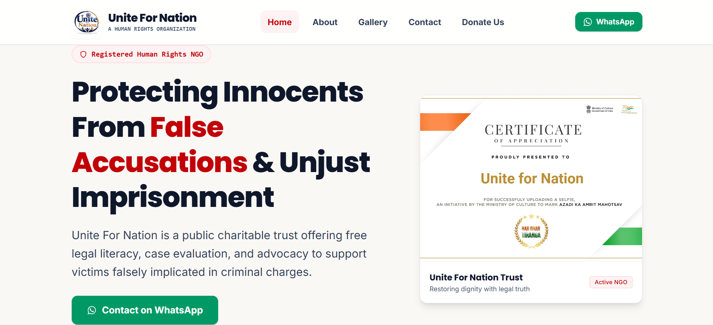
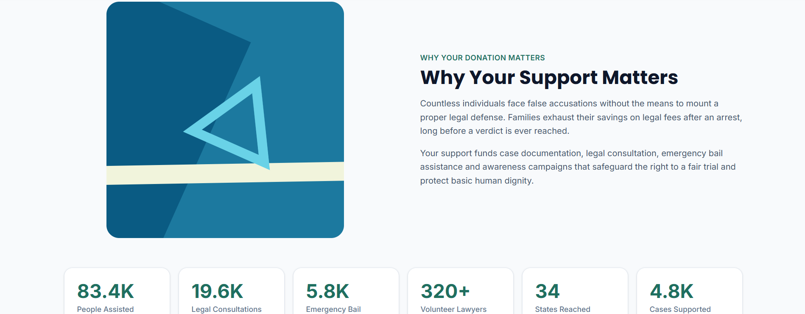
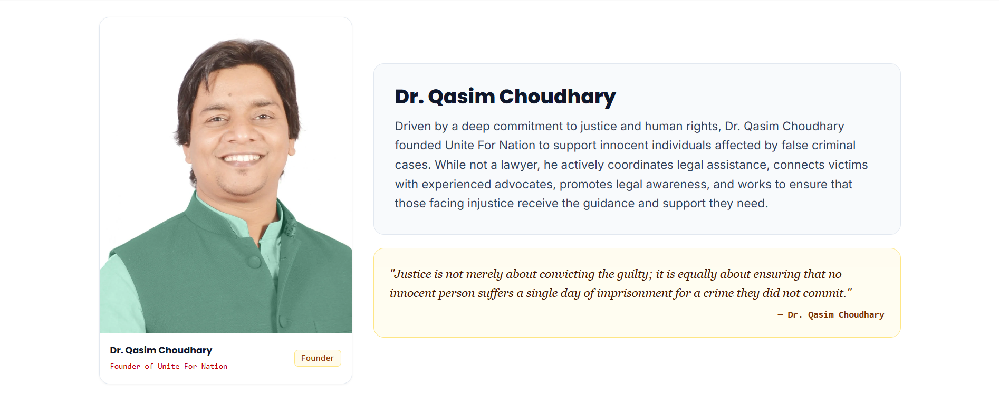
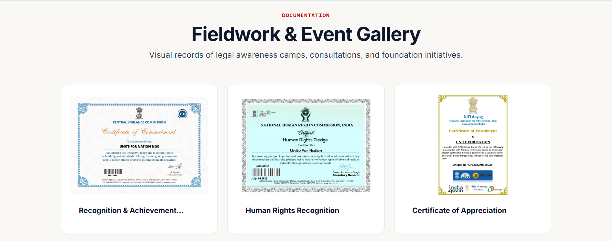

<div align="center">

# ⚖️ UNITE FOR NATION

### 🕊️ A Human Rights Organization — Fighting False Accusations & Restoring Justice

<br/>

<p>
  <a href="https://unite-for-nation.vercel.app/" target="_blank"></a>
  <a href="http://unitefornation.com/" target="_blank"></a>
  <a href="https://github.com/abufazal460/Unite-for-Nation" target="_blank"></a>
</p>

<p>
  
  
  
  
</p>

</div>

<br />

---

## 📸 Project Preview

> A quick look at the actual pages — homepage, donation flow, about, and gallery. *(Drop real screenshots into a `screenshots/` folder at the project root with these file names to have them show up here.)*

<table>
<tr>
<td width="50%">

**🏠 Home**


</td>
<td width="50%">

**💝 Donate**


</td>
</tr>
<tr>
<td width="50%">

**ℹ️ About**


</td>
<td width="50%">

**🖼️ Gallery**


</td>
</tr>
</table>

---

## 📖 Project Overview

**Unite For Nation** is a registered public charitable trust and **human rights organization** dedicated to defending individuals who are falsely accused, wrongfully implicated in fabricated criminal cases, or trapped in unjust imprisonment across India.

The organization provides **affordable, low-cost legal support** — connecting innocent citizens with pro-bono and low-fee legal representation, independent fact-finding, emergency bail assistance, and public legal literacy camps — specifically aimed at people who cannot afford expensive legal help. Backed by 12A and 80G government registration, NGO Darpan verification, and ISO certification, the trust operates with complete transparency around how every rupee is spent.

> This repository is the **frontend website** for Unite For Nation — the digital front door where visitors learn about the organization's mission, read verified certificates and media coverage, reach the legal helpline over WhatsApp, and **donate directly** through UPI, bank transfer, or a scannable QR code to fund real legal-aid work.

---

## ✨ Features

- ⚖️ **Human rights & legal-aid storytelling** — dedicated sections explaining the problem of false accusations, the organization's 5-step legal support process, and its measurable impact
- 💳 **Full donation flow** — a dedicated `/donate` page with tiered giving amounts, animated progress rings, a downloadable QR code, UPI ID, and complete bank transfer details with one-tap copy buttons
- 📈 **Animated impact counters** — key statistics (people assisted, legal consultations, emergency bail requests, volunteer lawyers) count up smoothly into view as you scroll
- 🧾 **Certificate & registration verification** — 12A, 80G, ISO and NGO Darpan certificates are displayed directly on the site so donors can verify legitimacy at a glance
- 📰 **Media coverage showcase** — newspaper, TV, and magazine features highlighting the organization's court victories and advocacy work
- 🖼️ **Fieldwork gallery with lightbox** — photos from legal awareness camps, achievement ceremonies, and community outreach, viewable in a fullscreen modal
- ❓ **FAQ accordion** — common donor questions (security, receipts, monthly giving, NGO verification) answered in a smooth, height-animated accordion
- 💬 **WhatsApp-first helpline** — a persistent WhatsApp button lets anyone facing a false case get instant, confidential legal guidance in one tap
- 🌊 **Buttery smooth scrolling** site-wide via Lenis, kept in sync with Framer Motion's scroll-triggered reveals
- 🗂️ **Zero hardcoded content** — every stat, certificate, testimonial, FAQ, and gallery image is pulled from a dedicated file in `src/data/` and rendered through a map/loop
- 🔍 **SEO built in, not bolted on** — deep meta tags, keyword targeting, canonical URL, Open Graph tags, and Google site verification aimed at ranking for legal-aid and human-rights search terms
- 🏗️ **Lightweight custom routing** — client-side navigation handled with a small `pushState`/`popstate` router instead of a routing library, keeping the bundle lean

---

## 📄 Pages

| Page | Route | What's there |
|---|---|---|
| **🏠 Home** | `/` | Hero, mission pillars, the 5-step legal-support process, key achievements, and a WhatsApp call-to-action |
| **ℹ️ About** | `/about` | Who the trust is, its core values, and a profile of the founder, Dr. Qasim Choudhary |
| **🖼️ Gallery** | `/gallery` | Photos from legal awareness camps, achievement ceremonies, and press coverage |
| **📞 Contact** | `/contact` | WhatsApp helpline, email, office address, social channels, and an embedded office location map |
| **💝 Donate** | `/donate` | Hero + QR, trust indicators, impact story with counters, tiered donation amounts, donation methods (UPI/bank/QR), transparency assurances, certificate verification, FAQ, and a final call-to-action |

---

## 🎨 Design & UI

The interface leans into a **trust-first, editorial look**: a warm off-white background (`#faf8f5`), deep slate text, and a confident red accent used sparingly for calls-to-action — evoking seriousness and credibility rather than a typical NGO template.

Typography pairs **Poppins** for headings with **Inter** for body copy, loaded via Google Fonts, giving the site a clean, modern, highly legible feel appropriate for legal and official content.

The donation page in particular uses a distinct dark **navy-to-teal gradient** hero panel to visually separate "giving" from the rest of the site, paired with gold accents on certificate cards to signal authenticity and trust. Icons throughout come from `react-icons` (Feather, Font Awesome 6, Heroicons, Lucide), and every interactive element — buttons, accordions, counters, progress rings — is animated with Framer Motion for a polished, non-static feel.

---

## 📱 Responsive Design

Built **mobile-first**, since most visitors reaching the WhatsApp helpline or donation page arrive from a phone. Tailwind's responsive utilities (`sm:`, `md:`, `lg:`) shape layout across breakpoints, with the navbar collapsing into a slide-down mobile menu and the donation hero stacking its QR panel below the copy on smaller screens.

---

## 🛠️ Tech Stack

**⚛️ Frontend**
- React 19
- Vite 6
- Tailwind CSS 4 (`@tailwindcss/vite`)
- Lightweight custom `pushState`/`popstate` client-side router (no routing library)

**🎞️ Animation**
- **Framer Motion** / `motion`
- Lenis (smooth scroll)

**🧩 Icons**
- `react-icons` (Feather, Font Awesome 6, Heroicons 2, Lucide)

**🧰 Version Control & Tooling**
- Git
- GitHub
- ESLint 9 (flat config)
- TypeScript type definitions for React (`@types/react`, `@types/react-dom`)
- npm

**☁️ Hosting & Deployment**

- Vercel (app hosting/deployment) — <a href="https://unite-for-nation.vercel.app/" target="_blank" rel="noopener noreferrer">unite-for-nation.vercel.app</a>

- Custom domain — <a href="https://unitefornation.com/" target="_blank" rel="noopener noreferrer">unitefornation.com</a>

---

## 📂 Project Structure


```
unite-for-nation/
├── index.html                    ⭐ App HTML entry + deep SEO meta tags
├── package.json                  ⭐ Dependencies & scripts
├── vite.config.js                ⭐ Vite build config
└── src/
    ├── App.jsx                   ⭐ Root component + custom pushState router
    ├── main.jsx                  ⭐ React entry point
    ├── index.css                 ⭐ Global styles, fonts, animations
    ├── components/
    │   ├── common/                # Button, Container, Icon, SectionTitle
    │   ├── layout/                # Navbar, Footer, MainLayout (+ Lenis)
    │   ├── sections/
    │   │   ├── about/
    │   │   ├── contact/
    │   │   ├── donate/            ⭐ full donation-flow module (amount tiers, QR/UPI/bank, impact, verification...)
    │   │   └── home/              # hero, mission, achievements, gallery, media coverage...
    │   └── ui/                    # Accordion, Badge, Card, CopyButton, Modal
    ├── data/                      ⭐ all site content — zero hardcoding
    │   ├── site.js, seo.js, navigation.js
    │   ├── certificates.js        ⭐ 12A / 80G / ISO / NGO Darpan details
    │   ├── donationAmountData.js, donationMethodData.js
    │   └── ...(about, gallery, testimonials, timeline, impact, etc.)
    └── pages/                     ⭐ route-level page components
        ├── Home.jsx
        ├── About.jsx
        ├── Donate.jsx             ⭐ donation page composition
        ├── Gallery.jsx
        ├── Contact.jsx
        └── NotFound.jsx
```

---

## 🚀 Performance & SEO

**⚡ Performance**
- Lenis-powered smooth scroll synced with Framer Motion's scroll-triggered animations
- Lazy-loaded, async-decoded images across the gallery, certificates, and media coverage sections
- A lightweight custom router avoids the overhead of a full routing library for a small page set
- Reduced repaint cost through count-up animations driven by `requestAnimationFrame`

**🔍 SEO**
- Extensive `<title>`, meta description, and long-tail keyword targeting around human rights, legal aid, and false-accusation defense
- Open Graph tags and a canonical URL pointing to `unitefornation.com`
- Google Search Console site verification tag
- `robots` set to `index, follow` for full search visibility

---

## ⚙️ Installation

### 1️⃣ Clone the repository

```bash
git clone https://github.com/abufazal460/Unite-for-Nation.git
cd Unite-for-Nation
```

### 2️⃣ Install dependencies

```bash
npm install
```

### 3️⃣ Run the development server

```bash
npm run dev
```

---

## 🔐 Environment Variables

> No environment variables are needed to run the frontend locally — content lives directly in the codebase under `src/data/`, including donation details, certificates, and contact information.

---

## 📜 Available Scripts

| Script | Description |
|---|---|
| `npm run dev` | Start the Vite development server |
| `npm run build` | Build the app for production |
| `npm run preview` | Preview the production build locally |
| `npm run lint` | Run ESLint across the project |

---

## 🚢 Deployment

The app is deployed on **Vercel** at [unite-for-nation.vercel.app](https://unite-for-nation.vercel.app/).

The production domain, **[unitefornation.com](http://unitefornation.com/)**, is registered and points to the Vercel deployment.

---

## 👤 Author

**Abu Fazal**

[](https://github.com/abufazal460)

---

## 📄 License

No license file is currently included in this repository. All rights reserved unless a license is added.
