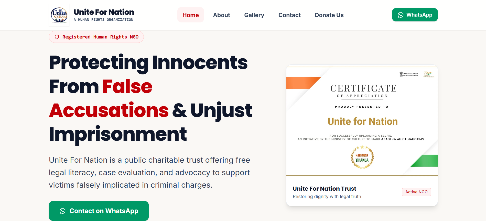
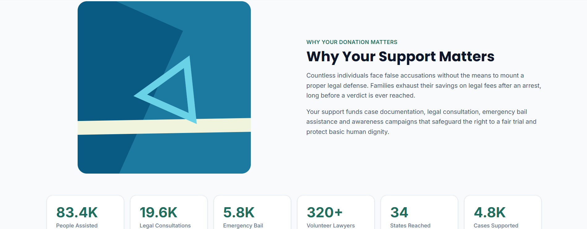
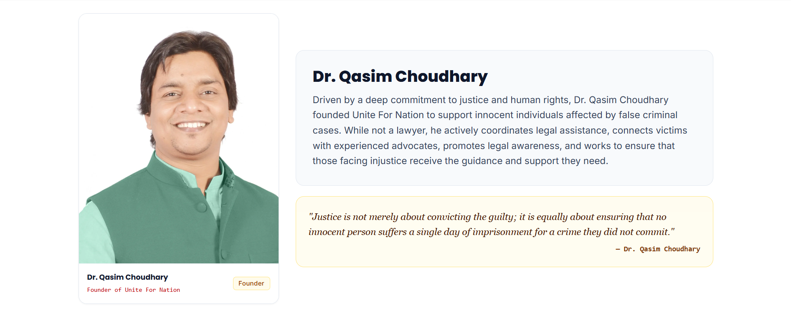
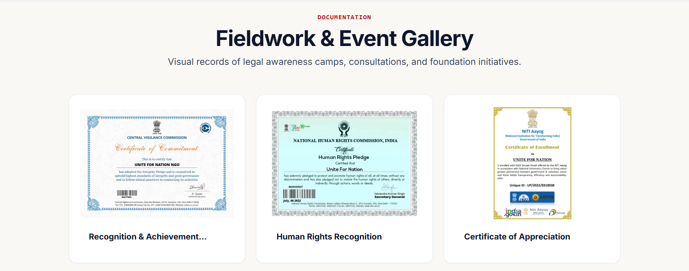

<div align="center">

# ⚖️ Unite for Nation

### A Human Rights Organization — Fighting False Accusations & Restoring Justice

<br/>

<p>
  <a href="https://unitefornation.com/" target="_blank"></a>
  <a href="https://unite-for-nation.vercel.app/" target="_blank"></a>
  <a href="https://github.com/abufazal460/Unite-for-Nation" target="_blank"></a>
</p>

<p>
  
  
  
  
</p>

</div>

<br />

---

## 📸 Project Preview

<table>
<tr>
<td width="50%">

### 🏠 Home


</td>
<td width="50%">

### 💝 Donate


</td>
</tr>
<tr>
<td width="50%">

### ℹ️ About


</td>
<td width="50%">

### 🖼️ Gallery


</td>
</tr>
</table>

---

## 📖 Project Overview

**Unite for Nation** is a registered human rights organization (Reg. No: `UP/2022/0318038`) based in New Delhi, India. The foundation works to support innocent individuals and underprivileged families who face fabricated criminal charges, false FIRs, and unlawful harassment.

Because legal defense in India is often prohibitively expensive, many falsely accused undertrials spend months or years behind bars without proper representation. Unite for Nation bridges this gap by connecting victims with experienced defense advocates, providing confidential document verification, conducting independent fact-finding, and running community legal awareness camps.

This repository contains the official frontend web application. It serves as the primary contact portal for individuals seeking urgent legal guidance, provides field documentation of past initiatives, and enables direct donations via UPI and bank transfer to support legal defense work.

---

## ✨ Features

- **Lightweight Client-Side Routing**: Custom `pushState`/`popstate` router in `src/App.jsx` avoids external routing dependencies, keeps bundle size lean, and automatically pairs lazy chunks with matching skeleton loaders.
- **Full Static Prerendering (Technical SEO)**: Dedicated post-build script (`scripts/prerender.mjs`) crawls route definitions and outputs static `.html` files with route-specific `<title>`, `<meta name="description">`, absolute canonical URLs, OpenGraph tags, and Twitter Cards.
- **Schema.org Structured Data**: Integrated JSON-LD schemas (`NGO`, `WebSite`, `AboutPage`, `ContactPage`, `CollectionPage`, `WebPage`) provide rich snippets for search engines with verified organization details and social links.
- **Hostinger / Apache Server Optimization**: Production `.htaccess` configuration handles clean URLs, trailing slash redirects (`/about/` → `/about`), direct serving of prerendered HTML (`/about` → `/about.html`), and a real 404 response with `noindex` headers.
- **Direct Donation System**: Dedicated `/donate` page featuring a downloadable Union Bank of India QR code, direct UPI ID (`qr919452900007-6897@unionbankofindia`), and account transfer details with one-click copy buttons.
- **Interactive Fieldwork Gallery**: Dynamic image gallery in `src/pages/Gallery.jsx` featuring responsive image loading, descriptive accessibility alt attributes, and a full-size modal lightbox viewer.
- **24/7 Helpline & Multi-Channel Contact**: Prominent WhatsApp direct chat integration, emergency helpline numbers, verified social media channels, and an embedded Google Maps view of the secretariat office in Jamia Nagar, New Delhi.
- **Smooth Inertia Scrolling**: Lenis smooth scrolling tuned for desktop viewports, automatically bypassed for touch devices and users with reduced-motion system preferences.
- **Centralized Data Layer**: Content throughout the site (statistics, navigation, contact details, FAQs, gallery items, founder bio) is organized modularly under `src/data/` for straightforward updates.

---

## 📄 Pages

| Page | Route | Description |
|---|---|---|
| **🏠 Home** | `/` | Hero carousel, core mission pillars, 5-step legal process, impact statistics, and WhatsApp contact banner |
| **ℹ️ About** | `/about` | Organization mission, historical context, core principles, and leadership profile of founder Dr. Qasim Chaudhary |
| **🖼️ Gallery** | `/gallery` | Visual documentation of legal aid camps, community consultations, and public awareness events with modal viewer |
| **📞 Contact** | `/contact` | Emergency helpline, email addresses, New Delhi office address, social channels, and interactive Google Maps embed |
| **💝 Donate** | `/donate` | Hero banner with trust indicators, downloadable QR code, UPI details, bank account info with copy buttons, and donor FAQs |
| **🚫 404** | `/404` | Custom not-found screen with home return action, configured with `noindex, follow` robots directives |

---

## 🎨 Design & UI

The visual design is structured around trust, readability, and authority:

- **Color Palette**: Warm off-white background (`#faf8f5`), deep slate typography (`#1e293b`), balanced emerald/teal accents (`#2A9D8F`), and an authoritative red primary tone (`#b91c1c`) for critical action buttons.
- **Typography**: Clean typographic pairing using **Poppins** for headings and **Inter** for long-form body text, imported via Google Fonts.
- **Accessibility**: Meaningful visible `<h1>` tags on every page, logical `<h2>`/`<h3>` heading hierarchy, descriptive image `alt` attributes, and clean focus states.
- **Micro-Interactions**: Subtle enter animations and accordions powered by Motion (`motion/react`) alongside custom CSS keyframes.

---

## 📱 Responsive Design

Built mobile-first from the ground up:
- Navigation automatically transitions to a slide-down mobile menu on smaller screens.
- Image carousels swap between landscape and portrait assets via `<picture>` breakpoint queries.
- Donation methods and contact information collapse into single-column cards on mobile devices for easy reading and one-tap interaction.

---

## 🛠️ Tech Stack

### Frontend Core
- **React 19** (`react`, `react-dom`)
- **Vite 6** (`vite`, `@vitejs/plugin-react`)
- **Tailwind CSS 4** (`@tailwindcss/vite`)
- Custom `pushState` / `popstate` SPA router

### Animation & Interaction
- **Motion 12** (`motion`)
- **Lenis** (`lenis`) for smooth momentum scrolling

### Icons & Assets
- **React Icons** (`react-icons`: Font Awesome 6, Feather, Material Design)

### SEO & Server Setup
- Custom post-build prerender engine (`scripts/prerender.mjs`)
- Schema.org JSON-LD structured data engine (`src/seo/seo.js`)
- Apache HTTP Server configuration (`public/.htaccess`)

### Tooling & Code Quality
- **ESLint 9** with flat config (`eslint.config.js`)
- **npm** package manager

---

## 📂 Project Structure

```text
Unite-for-Nation/
├── public/
│   ├── .htaccess             # Apache rewrite rules (clean URLs & prerender mapping)
│   ├── favicons.webp         # Website favicon
│   ├── og-image.png          # OpenGraph social share card (1200x630)
│   ├── qr code.jpeg          # Donation QR code image
│   ├── robots.txt            # Search engine crawler directives & sitemap link
│   └── sitemap.xml           # XML sitemap with all indexable routes
├── scripts/
│   └── prerender.mjs         # Build-time static HTML head injection script
├── src/
│   ├── App.jsx               # Route resolver, skeleton manager & router listener
│   ├── main.jsx              # React application entry point
│   ├── index.css             # Tailwind CSS entry & global utility styling
│   ├── assets/               # Brand logos, founder portraits, works & gallery images
│   │   └── readme/           # Screenshots used in README documentation
│   ├── components/
│   │   ├── common/           # Button, Container, Icon, PageSkeleton, SectionTitle
│   │   ├── layout/           # Navbar, Footer, MainLayout (Lenis & SEO listener)
│   │   ├── sections/         # Page-specific components (home, about, contact, donate)
│   │   └── ui/               # Accordion, Badge, Card, CopyButton, Modal
│   ├── data/                 # Data modules (about, contact, gallery, hero, site, etc.)
│   ├── pages/                # Route components (Home, About, Contact, Donate, Gallery, NotFound)
│   └── seo/
│       └── seo.js            # Central metadata, Schema.org builder & head sync helper
├── index.html                # Base HTML template with font links and skeleton
├── package.json              # Project scripts and dependency definitions
├── vite.config.js            # Vite build configuration & dev server options
└── eslint.config.js          # ESLint 9 configuration file
```

---

## 🚀 Performance & SEO

- **Static HTML for Crawlers**: When running `npm run build`, `scripts/prerender.mjs` generates pre-populated HTML heads for every route in `dist/`. Search engine bots get complete metadata, titles, and schema without needing to execute JavaScript.
- **Self-Referencing Canonicals**: Every indexable page carries its own explicit HTTPS canonical URL pointing to `https://unitefornation.com/`.
- **404 Handling**: Unknown URLs trigger Apache's `ErrorDocument 404 /404.html`, ensuring a proper HTTP 404 status code while serving a branded page marked with `noindex, follow`.
- **Zero Keyword Stuffing**: Meta tags are written for natural search intent, avoiding penalty-inducing keyword repetition.
- **Resource Optimization**: Critical fonts preconnected to Google Fonts; hero banners use responsive image sources (`<picture>`); lazy-loading applied to below-the-fold media.

---

## ⚙️ Installation & Local Setup

### 1. Clone the repository

```bash
git clone https://github.com/abufazal460/Unite-for-Nation.git
cd Unite-for-Nation
```

### 2. Install dependencies

```bash
npm install
```

### 3. Start development server

```bash
npm run dev
```

The app will be available locally at `http://localhost:3000`.

---

## 🔐 Environment Variables

No environment variables are required to run this project. All content, configuration, and donation information are maintained directly in the codebase under `src/data/`.

---

## 📜 Available Scripts

| Command | Action |
|---|---|
| `npm run dev` | Starts the Vite development server on `0.0.0.0:3000` |
| `npm run build` | Compiles frontend assets with Vite and executes `prerender.mjs` |
| `npm run preview` | Starts a local static preview server of the built `dist` folder |
| `npm run lint` | Runs ESLint 9 across all project files |

---

## 🚢 Deployment

The production build produces a fully static distribution in the `dist/` directory:

```bash
npm run build
```

### Deployment Flow:
1. `vite build` bundles JavaScript, CSS, and static assets into `dist/`.
2. `node scripts/prerender.mjs` generates route-specific static HTML files (`index.html`, `about.html`, `gallery.html`, `contact.html`, `donate.html`, `404.html`) in `dist/`.
3. The contents of `dist/` are uploaded to the production host (**Hostinger** / Apache server).
4. `.htaccess` handles HTTPS redirection, clean URL routing, and serves pre-rendered HTML files directly.

- **Production Domain**: [https://unitefornation.com/](https://unitefornation.com/)
- **Vercel Mirror**: [https://unite-for-nation.vercel.app/](https://unite-for-nation.vercel.app/)

---

## 👤 Author

**Abu Fazal**
- GitHub: [@abufazal460](https://github.com/abufazal460)
- Portfolio: [abufazal.netlify.app](https://abufazal.netlify.app/)

---

## 📄 License

This project is private and proprietary to **Unite for Nation Human Rights Foundation**. All rights reserved.
